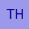

# avatar

[](https://godoc.org/github.com/go-mods/avatar)
[](https://goreportcard.com/report/github.com/go-mods/avatar)
[](https://github.com/go-mods/avatar/blob/master/LICENSE)

Avatar is a Go package that generates avatar from name.

## Circle avatar


## Square avatar





## Custom avatar


## Color palette from initial


# Avatar server

Use docker to run the server:

```bash
docker build -t avatar-server .
docker run -t --rm -v ./assets:/avatar/assets -p 8080:8080 -d --name avatar-server avatar-server
```

or use docker-compose:

```bash
docker-compose build
docker-compose up -d
```

## Generate an avatar

```bash
http://localhost:8080/api?name=John%20Doe
http://localhost:8080/api?name=John%20Doe&shape=square&width=200&height=200&backgroundColor=red&fontColor=white&fontFamily=Caprasimo&fontWeight=400&borderWidth=10&borderColor=blue&borderDash=10,10&borderRadius=50&padding=5
```

## Options (query params) to use to customize the avatar initial
query parameter | type
--------------- | ----
name | string
separator | string
sensitive | string
lowercase | boolean
uppercase | boolean
camelcase | boolean
length | number
wordLength | boolean

## Options (query params) to use to customize the avatar
query parameter | type
--------------- | ----
width | number
height | number
backgroundColor | string
fontFamily | string
fontWeight | string
fontSize | number
fontColor | string
shape | string (circle, square)
borderDash | string (css border dash)
borderWidth | number
borderRadius | number
borderColor | string
padding | number
randomFontColor | boolean
randomBorderColor | boolean
